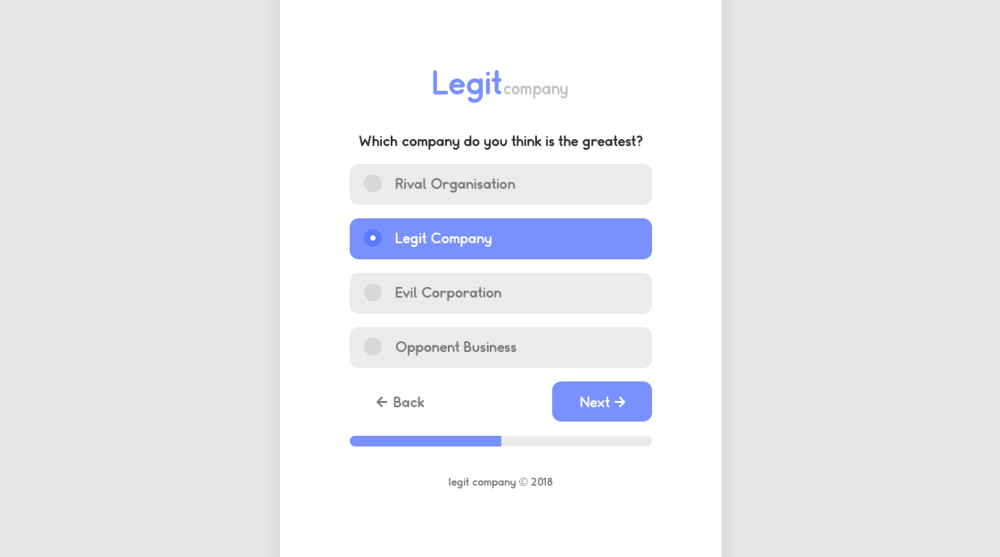

# Junior Frontend - Zadanie rekrutacyjne

Cześć! Gratulujemy przejścia do kolejnego etapu rekrutacji na Junior Frontend Developera w Adprofity. Przeczytaj uważnie zadanie i do dzieła :). 

## Opis

Twoim zadaniem jest przygotowanie projektu prostej ankiety w technologiach web'owych (czyt. HTML, CSS, JS, etc.), na podstawie podanego wzorca.

## Wymagania

Lista rzeczy, które Twój projekt absolutnie musi spełnić:

- Działanie. Ankieta musi być w pełni działająca, odpowiedzi zaznaczalne, przyciski "Back" i "Next" funkcjonalne, pasek progresu pod ankietą ruchomy.
- Budowa. W projekcie wymagane jest użycie gulp/webpack/rollup/podobne.
- Konfigurowalność. Treści pytań, odpowiedzi, oraz ich ilość musi być zmienialna w możliwie jak najprostszy sposób.
- Responsywność. Strona nie psuje się np. na urządzeniu mobilnym.
- Optymalizacja. Mimo braku wielu obrazków czy innych mediów czas wczytywania strony powinien być jak najkrótszy.

## Punkty dodatkowe

Nie wymagane, ale będą dodatkowo oceniane:

- Frontend'owy framework - react, vue, angular, mithril, masz pełną dowolność!
- Użycie ES6+ w kodzie, lubimy nowe rzeczy.
- Użycie preprocesora css (Sass, Less, stylus, etc.).
- Dodanie prostych animacji (zaskocz nas czymś ciekawym).
- Umieszczenie treści pytań ankiety w zewnętrznym pliku `.json`. W jaki sposób będziesz je wczytywał jest zależne od Ciebie, liczymy na kreatywność!

## Zasoby

W folderze `res/` tego repozytorium znajdziesz pliki które przydadzą Ci się w tworzeniu projektu. Użyta czcionka to [`Somatic`](https://befonts.com/somatic-font-family.html) w rozmiarze `16px`, ikonki wzięte z Font Awesome 5. Treść ankiety oraz pytań jest dowolna.

## Wskazówki

- Udostępnij projekt w sposób który możemy łatwo obejrzeć (np. na GitHub pages).
- Kod twojego projektu musi być udostępniony na GitHub'ie, tak abyśmy mogli go łatwo sklonować.
- Twój projekt nie musi w pełni 1:1 odzwierciedlić podanego wzorca (być pixel perfect), wystarczy jedynie go odwzorować.

**W razie pytań, pisz do nas śmiało!**
